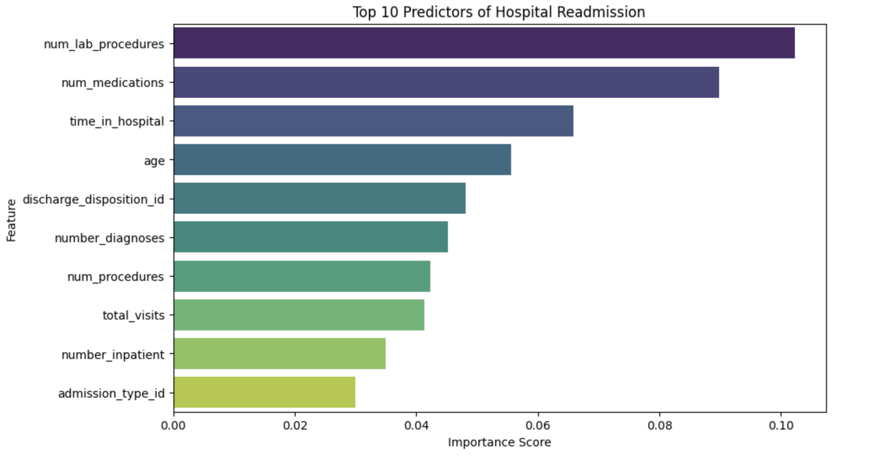
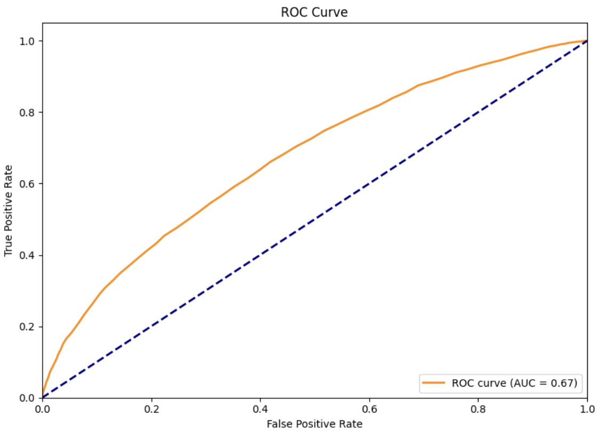

# Diabetes-Remission-Prediction
Predicting hospital readmission rates for diabetic patients using Random Forest and Gradient Boosting

# Hospital Readmission Prediction for Diabetes Patients

### Project Overview
Hospital readmissions are a major concern in healthcare, costing billions annually and indicating poor patient outcomes. This project analyzes a dataset of **100,000+ patient records** from 130 US hospitals from 1999-2008 to predict whether a diabetic patient will be readmitted within 30 days.

### Objective
To build a machine learning model that identifies high-risk patients *before* they are discharged, allowing healthcare providers to intervene and reduce readmission rates.

### Tech Stack
* **Language:** Python
* **Libraries:** Pandas, NumPy, Scikit-Learn, Matplotlib, Seaborn
* **Models:** Logistic Regression, Random Forest, Gradient Boosting

### Key Findings
After cleaning the data and making new features (such as `total_visits`), the **Random Forest Classifier** emerged as the best and most efficient model.

**Top Predictors of Readmission:**
1.  **Number of Lab Procedures:** Frequent testing often indicates unstable health.
2.  **Total Prior Visits:** Patients with a history of past emergency/inpatient visits are high-risk for readmission.
3.  **Number of Medications:** Having multiple medications is a strong indicator of unstable health and more health conditions.
4.  **Time Spent in Hospital:** Longer stays in inpatient hospitals indicates more severe health condidtions.

### Results
* **Accuracy:** ~63% (Baseline: 50%)
* **AUC Score:** 0.67
* **Impact:** The model successfully captures **52%** of readmitted patients (Recall), significantly better than random chance.

### Future Improvements
* Address class imbalance using SMOTE.
* Incorporate NLP to analyze free-text notes (if available).
